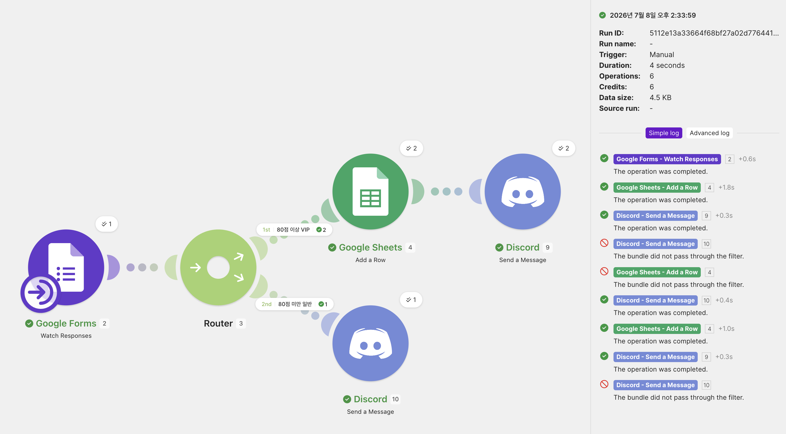
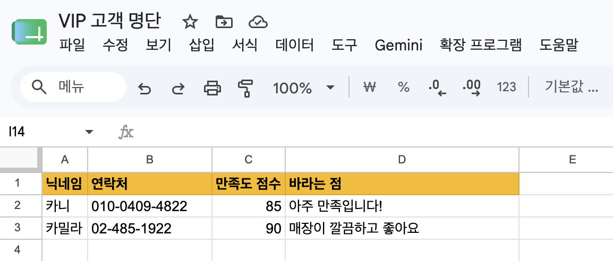
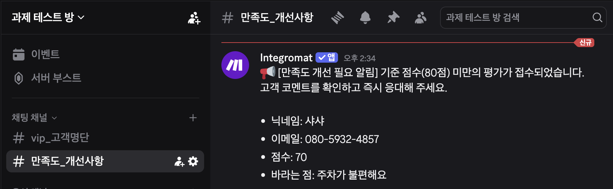
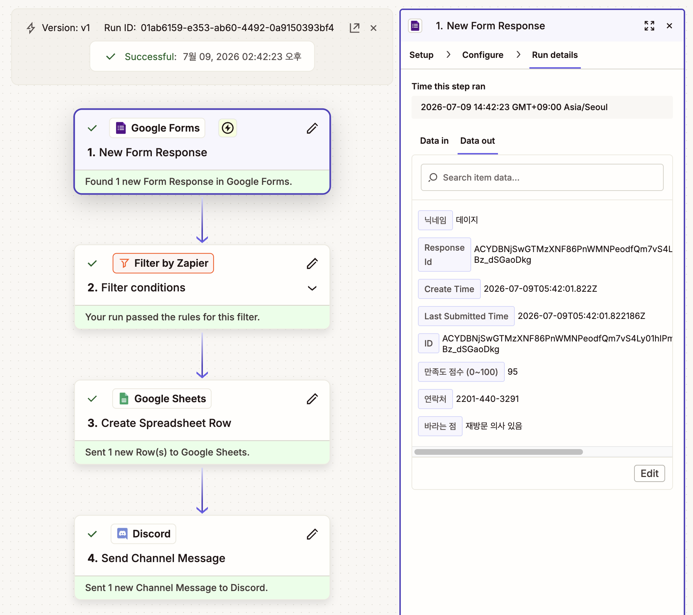
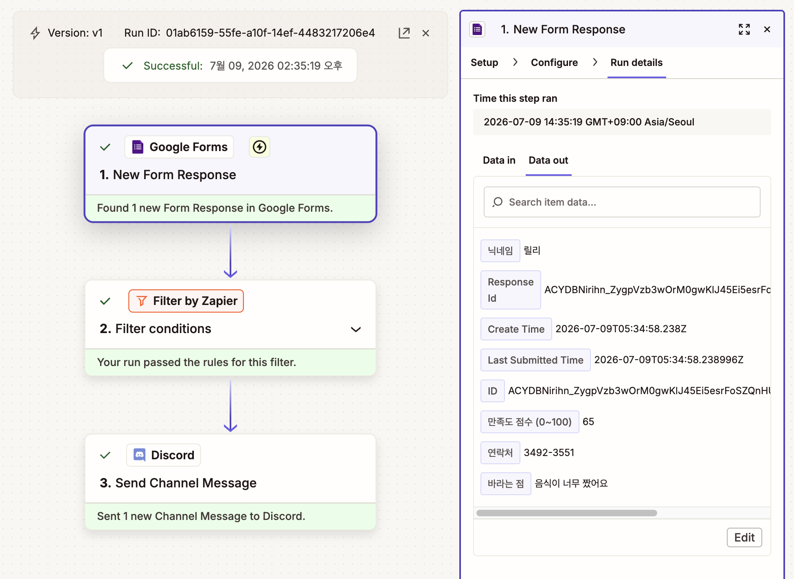
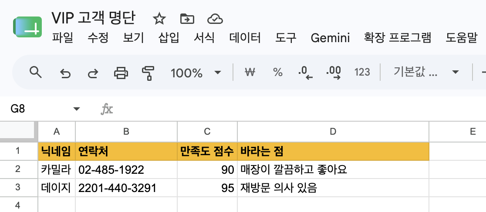
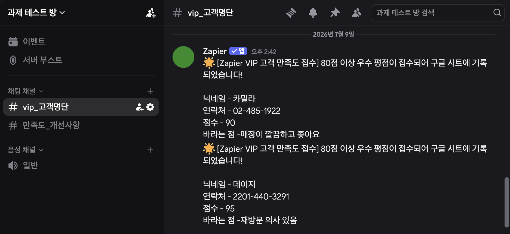
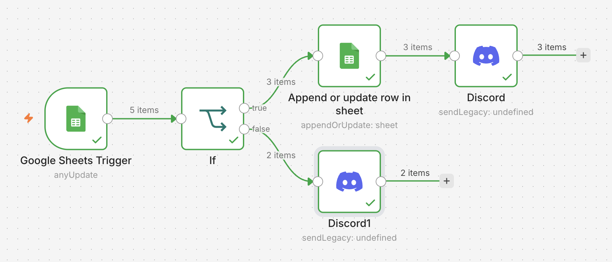
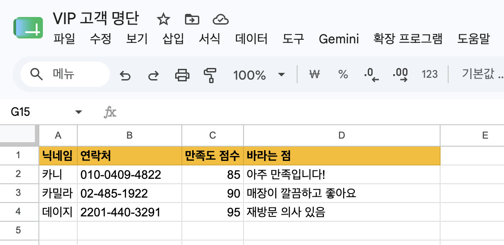
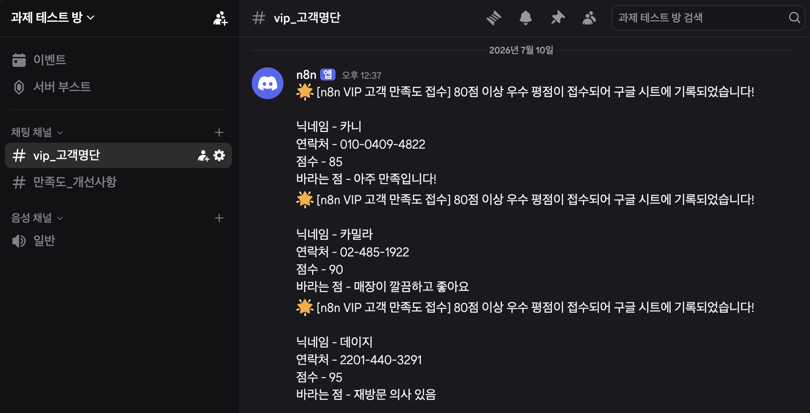

# Make vs Zapier vs n8n 비교 분석 보고서

## 1. 구현한 워크플로우

- [Google Form](https://forms.gle/QReCx6BENnHXSadM7) 제출 → 조건 분기(점수 기준) → [Google Sheets](https://docs.google.com/spreadsheets/d/1P0FfHS6PVQz8u2AHlp7DggPs5HMle4F5eQ_Tox7iuNI/edit?usp=sharing) 기록 + Discord 알림

## 2. 구현 과정 요약

### 2-1. Make: 120분 소요, Gmail 연동 실패와 value값 설정을 잘못하여 오래 걸렸음

1. [Make](http://www.make.com/)에서 새 Scenario 생성
2. **Trigger**: `Google Forms - Watch Responses` 모듈 추가
    - 설문 응답 실시간 감지
3. **Router** 추가 → 두 갈래 길 만들기
    - 경로 A: 점수 ≥ 80 조건 설정
    - 경로 B: 점수 < 80 조건 설정
4. 각 경로에 **Action** 연결: Google Sheets 기록 + Discord 알림
    - **Action 1**: `Google Sheets - Add a Row` 모듈 추가
        - 우수 평점 고객 VIP 데이터 아카이빙
    - **Action 2:** `Discord - Post a Message` 모듈 추가
        - `# vip_고객명단` 채널로 알림
    - **Action 3**: `Discord - Post a Message` 모듈 추가
        - `# 만족도_개선사항` 채널로 개선 알림

<b>테스트 결과</b>

    
    

    

### 2-2. Zapier: 60분 소요, 같은 Trigger를 두 번 설정하여 두 배로 시간 소요

|||
| - | - |

1. [Zapier](https://zapier.com/)에서 새 Zap 1, Zap 2 생성
    - 무료 플랜의 **다중 분기 기능 제한**으로 총 2개의 Zap으로 분할 구현.
2. **Trigger**: `Google Forms - New Form Response` 모듈 추가
    - 설문 응답 실시간 감지
3. **Filter (조건 분기)**: `Filter by Zapier` 모듈 추가
    - Zap 1: 점수 > 79* 조건 설정 (`(Number) Greater than` 연산자 사용)
    - Zap 2: 점수 < 80 조건 설정 (`(Number) Less than` 연산자 사용)
4. Zap 1에 **Action** 연결: Google Sheets 기록 + Discord 알림
    - **Action 1**: `Google Sheets - Create Spreadsheet Row` 모듈 추가
        - 우수 평점 고객 VIP 데이터 아카이빙
    - **Action 2:** `Discord - Send Channel Message` 모듈 추가
        - `# vip_고객명단` 채널로 알림
5. Zap 2에 **Action** 연결: Discord 알림
    - **Action 1**: `Discord - Send Channel Message` 모듈 추가
        - `# 만족도_개선사항` 채널로 개선 알림

<b>테스트 결과</b>

    
    

 
    

### 2-3. n8n: 30분 소요, Make와 유사하여 어렵지 않게 성공

1. [n8n](http://n8n.io/)에서 새 workflow 생성
2. **Trigger**: `Google Sheets Trigger - Append or update row in sheet` 모듈 추가
    - Google Forms 전용 노드가 없어 Google Sheets Trigger로 구현
3. **If (조건 분기)**: `IF` 모듈 추가 → 두 갈래 길 만들기
    - 경로 A: 점수 ≥ 80 조건 설정 (`(Number) Greater than or equal to` 연산자 사용)
4. 각 경로에 **Action** 연결: Google Sheets 기록 + Discord 알림
    - **Action 1**: `Google Sheets - Append or update row in sheet` 모듈 추가
        - 우수 평점 고객 VIP 데이터 아카이빙
    - **Action 2:** `Discord - Send a message` 모듈 추가
        - `# vip_고객명단` 채널로 알림
    - **Action 3**: `Discord - Send a message` 모듈 추가
        - `# 만족도_개선사항` 채널로 개선 알림

<b>테스트 결과</b>

    
    

 
    

## 3. 비교표

| 항목 | Make | Zapier | n8n |
| --- | --- | --- | --- |
| UI/UX | 원형 노드+선 연결 | 위→아래 직렬 체크리스트 | 노드+선 연결 (Make와 유사) |
| 설정 난이도 | 중 | 하 (가장 직관적) | 중~상 (JSON 데이터 구조에 대한 기초 이해 필요) |
| 조건 분기 | Router (다중 분기) | Filter (무료는 Zap 분리 필요) | IF (2분기) / Switch (다중) |
| 연동 서비스 범위 | 3,000+ 앱 | 7,000+ 앱 (전 세계 거의 모든 SaaS 및 앱 연동 가능) | 일반 앱 연동은 상대적으로 적음 |
| 무료 플랜 | 매우 넉넉 (월 1,000 크레딧) | 매우 제한적 (월 100회) | Cloud는 14일 체험 / 자가호스팅 시 무제한 무료 |
| 실행 로그 | 실행 히스토리, 단계별 데이터를 직관적으로 확인 가능 | Task History 메뉴에서 과거 기록을 텍스트 목록으로 확인 | 가장 상세한 노드별 추적이 가능 |

## 4. 장단점 정리

### 4-1. Make
| 장점 | 단점 |
| --- | --- |
| • 노드 방식으로 전체 흐름을 한눈에 파악하기 좋음 • 시각적 Router로 다중 분기를 한 화면에서 구성 가능 • 무료 플랜이 넉넉해 일상 자동화 충분히 가능 • 분기가 안 될 때 단계별 데이터를 직관적으로 확인하여 원인을 찾기가 쉬움 | • 처음엔 모듈/시나리오 등 용어가 낯설어 첫 Trigger 설정에 오랜 시간 소요 |

### 4-2. Zapier
| 장점 | 단점 |
| --- | --- |
| • 직렬 체크리스트 구조로, 화면이 가장 단순하고 깔끔함 • 각 단계마다 "Test step" 버튼으로 즉시 테스트 가능 • Make보다 앱 연동이나 계정 연결 과정이 매끄러웠음 • 실행 시 Make보다 좀 더 가벼운 느낌이 들었음 | • 무료 플랜에서는 조건 분기(Paths)를 지원하지 않아 Zap을 2개로 쪼개야 했고, 같은 Trigger를 두 번 설정하는 **중복 작업 발생** • Zap이 2개로 나뉘니 실행 기록도 따로 봐야 해서 전체 흐름을 한눈에 파악하기 어려웠음 • `Greater than or equal to` 연산자가 없어 숫자를 바꿨음 • 무료 한도가 세 도구 중 가장 적음 |

### 4-3. n8n
| 장점 | 단점 |
| --- | --- |
| • Make와 유사한 노드 방식으로 좀 더 직관적 • "Execute Workflow"로 수동 실행하면 각 노드에 흐르는 데이터의 입력/출력을 눈으로 직접 확인 가능 • 자가호스팅 시 영구 무료 + 실행 횟수 무제한이라는 독보적 선택지 | • Google Forms 전용 노드가 없어 Sheets Trigger로 우회 구현해야 했음 • 데이터 구조에 대한 기본적인 이해가 필요하여 비전공자에게 다소 어려울 수 있음 • Cloud 무료는 14일 체험판으로, 영구 무료가 아님 |

## 5. 어떤 상황에 어떤 도구가 적합한가 (내 의견)

세 도구를 동일한 워크플로우로 구현해 본 결과, **n8n** → **Make** → **Zapier** 순으로 추천!

- **실행량이 많거나 데이터 보안 및 통제가 중요한 경우**는 n8n 🥇
- **조건 분기가 여러 개인 복잡한 워크플로우**에는 Make 🥈
- **분기 없는 단순한 구조의 워크플로우로 빠른 결과**를 내려면 Zapier 🥉