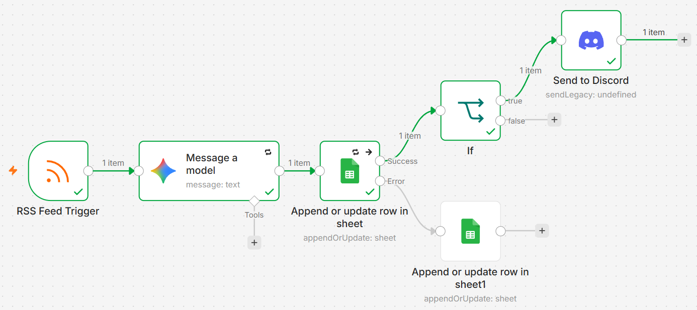
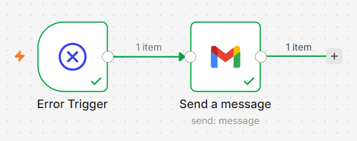
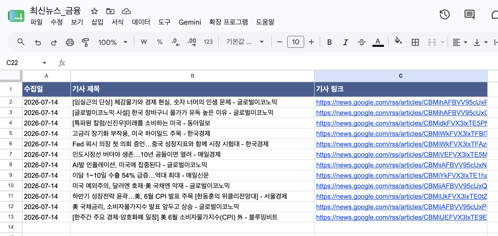
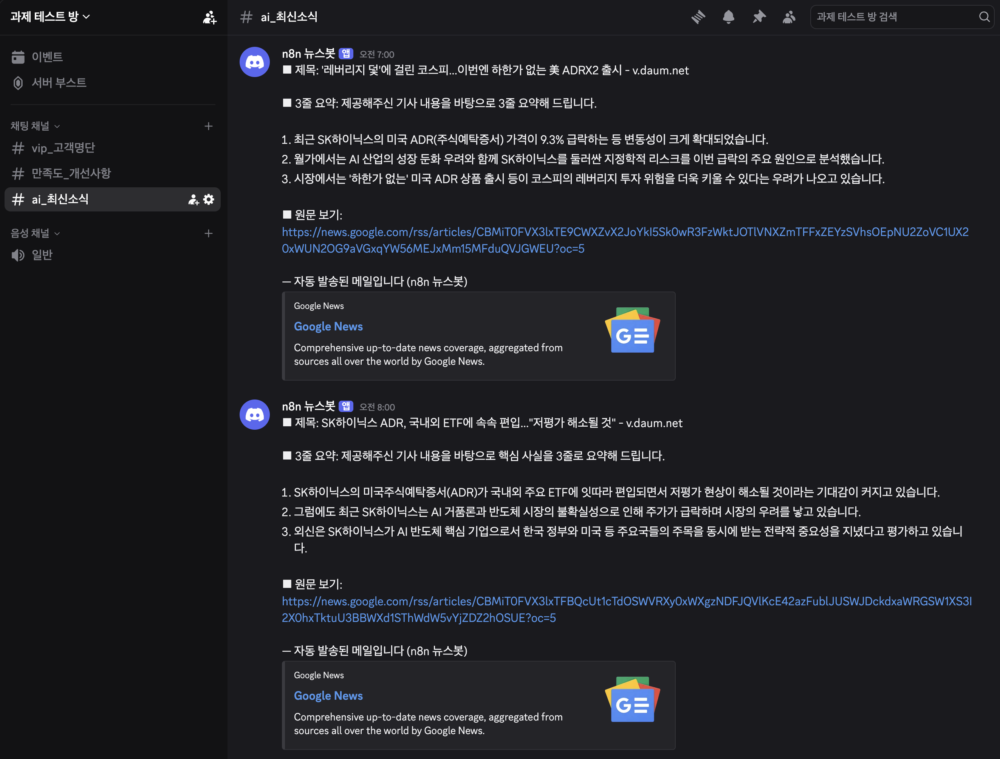
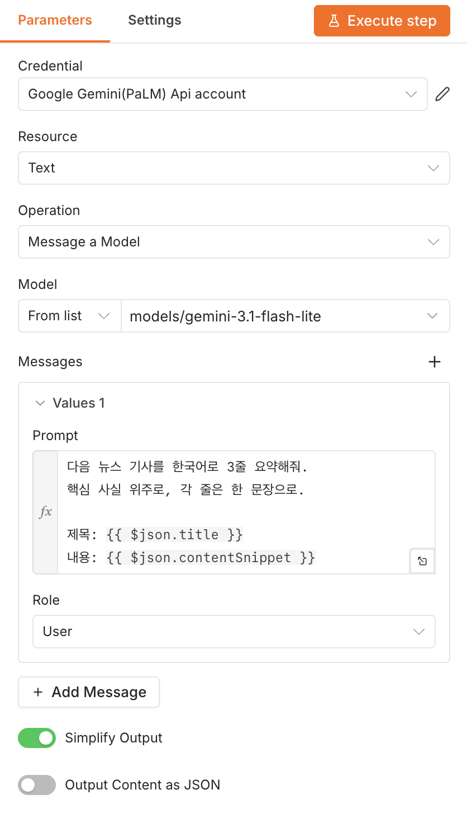
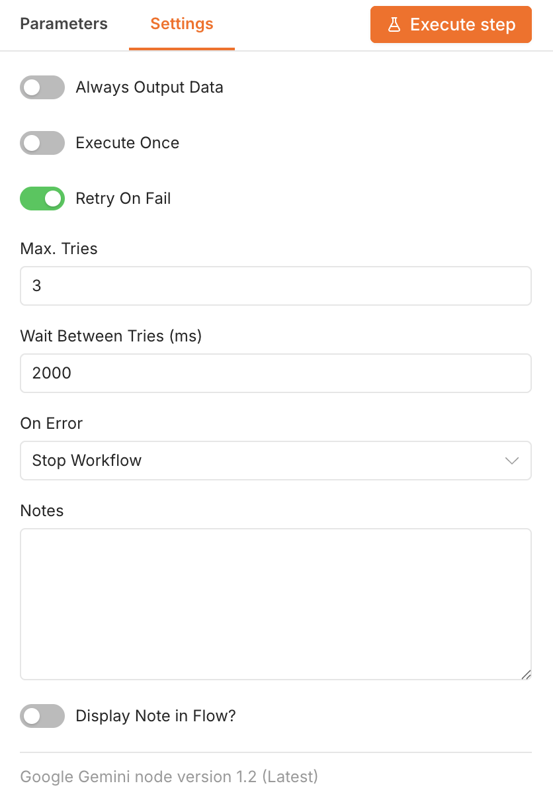
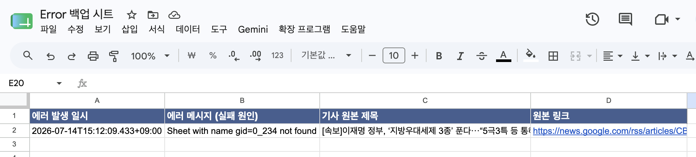
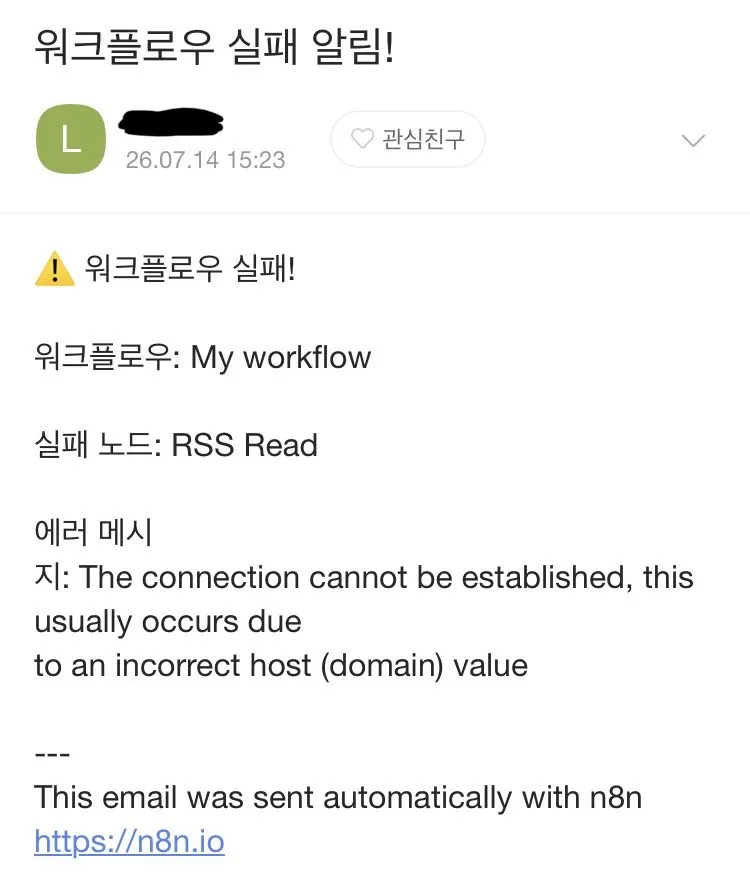

# 뉴스 요약 자동화 설계 및 구현

## 1. 자동화할 반복 업무 정의

- **업무:** AI 최신 뉴스 수집, 요약 및 아카이빙 자동화

- **기존 방식의 문제점:** 매일 쏟아지는 방대한 기사를 사람이 일일이 검색하고, 전체 본문을 읽고 핵심을 요약하여 데이터베이스에 기록하는 과정은 막대한 **시간과 에너지가 소모되는 단순 반복 업무**

- **자동화 목표:** RSS를 통해 **경제 분야 최신 기사를 실시간으로 감지**하고, 생성형 AI를 활용해 **핵심만 3줄로 요약**한 뒤, Google Sheets에 기록. **AI 관련 기사**만 Discord로 알림


## 2. 도구 선정: n8n(Cloud 버전)

| 기준 | 판단 근거 |
| --- | --- |
| 실행 횟수 제한 | 뉴스는 하루에도 수십 건 발생하므로, 자가호스팅 시 영구 무료 + 실행 횟수 무제한으로 쓸 수 있는 n8n으로 선정하였으나 보안상 클라우드 버전으로 테스트 |
| RSS 지원 | RSS Feed Trigger를 기본 노드로 제공 |
| 오류 처리 기능 | 노드별 Retry, 에러 전용 출력(error output), Error Workflow 등 **오류 처리 기능이 3사 중 가장 풍부**하여 보너스2 요구사항 구현에 유리 |
| 프로젝트1 경험 | 프로젝트1에서 n8n의 단점(전용 앱 노드 부족, 예: Google Forms 미지원)도 경험했으나, 본 프로젝트는 RSS·AI·Sheets·Discord 등 n8n이 모두 지원하는 노드로 구성되어 해당 단점이 문제가 되지 않았음 |

> Zapier는 직렬 구조의 특성상 에러 우회 경로를 설계하기 까다롭고 과도한 비용(Task)이 발생. Make는 훌륭한 에러 핸들링 모듈(Break, Resume 등)을 지원하지만 워크플로우가 커질수록 캔버스가 복잡해지는 단점이 있고, n8n의 `Error Trigger`처럼 '모든 워크플로우의 에러를 한 곳에서 잡아내는 글로벌 전담망'을 기본 기능으로 지원하지 않음
> 


## 3. 자동 실행 구조 (구현 결과)

### 3-1. 전체 워크플로우 설계도

```
[메인 워크플로우]
RSS Feed Trigger (매 1시간 폴링)
   → AI 노드 (Gemini, 3줄 요약 생성)
   → Google Sheets: 메인 시트에 기록
        ├─ 성공 → If ('AI' 포함 기사) → Discord 알림 발송
        └─ 실패(error output) → 백업 시트에 적재

[에러 워크플로우]
Error Trigger → Gmail 실패 알림
```
<br>

📸 스크린샷 1: 메인 워크플로우 전체 캔버스<br>


📸 스크린샷 2: Error Workflow 캔버스<br>


### 3-2. 자동 실행 방식

- **트리거:** RSS Feed Trigger가 1시간마다 피드([Google 경제](https://news.google.com/rss/topics/CAAqIggKIhxDQkFTRHdvSkwyMHZNR2RtY0hNekVnSnJieWdBUAE?hl=ko&gl=KR&ceid=KR%3Ako))를 폴링하여 새 기사를 감지
- 새 기사가 감지되면 이후 노드가 자동 실행되며, **사람의 개입이 전혀 필요 없음**
- 워크플로우 Active 상태로 9시간 운영, 총 12건의 기사가 자동 처리됨


## 4. 워크플로우 흐름 설명

| 단계 | 노드 | 역할 | 주요 설정 |
| --- | --- | --- | --- |
| 1 | RSS Feed Trigger | 새 기사 감지 | Feed URL: [Google 경제](https://news.google.com/rss/topics/CAAqIggKIhxDQkFTRHdvSkwyMHZNR2RtY0hNekVnSnJieWdBUAE?hl=ko&gl=KR&ceid=KR%3Ako) |
| 2 | Gemini | 기사 3줄 요약 생성 | 모델: `gemini-3.1-flash-lite`, Retry 3회 |
| 3 | Google Sheets | 날짜/제목/링크/요약 기록 | Append Row, On Error: Continue(error output) |
| 4 | Discord | 요약 알림 발송 | Webhook, 메시지: 제목+요약+링크 |
| 5 | Google Sheets (백업) | 3단계 실패 시 임시 적재 | 3단계의 에러 출력에 연결 |
<br>

**AI 프롬프트:**

```
다음 뉴스 기사를 한국어로 3줄 요약해줘.
핵심 사실 위주로, 각 줄은 한 문장으로.

제목: {{ $json.title }}
내용: {{ $json.contentSnippet }}
```
<br>

📸 스크린샷 3: 시트에 기록된 AI 요약 결과<br>


📸 스크린샷 4: Discord에 도착한 요약 알림<br>



## 5. 보너스 1 — AI 연동 Action

- **연동 모델:** `gemini-3.1-flash-lite` (API 키 발급 후 n8n Credential로 연결)
- **역할:** RSS로 수집한 기사 본문을 입력받아 **3줄 요약 텍스트를 자동 생성**
- **결과 품질:** 2건 테스트 결과, 기사의 핵심 내용만 빠르게 파악하기 좋았음

<br>

📸 스크린샷 5: AI 노드 설정 화면(프롬프트 포함)
|||
| --- | --- |


## 6. 보너스 2 — 실패 알림 및 재시도 전략

오류 처리를 **3중으로** 설계하고, 각각 **고의로 실패를 유발해 검증**했다.

> ① 일시적 오류는 노드 Retry(3회)로 자동 복구, ② 저장 실패는 에러 출력을 통해 백업 시트로 우회, ③ 그래도 실패하면 Error Workflow가 이메일로 즉시 알림.
> 

| 오류 처리 | 설계 내용 | 검증 방법 | 결과 |
| --- | --- | --- | --- |
| **① 자동 재시도** *(Auto Retry)* | AI 및 Sheets 노드에 자동 재시도 설정(Max Tries: **3회**, Wait Interval: **2초**) | 의도적인 잘못된 요청을 전송하여 네트워크 일시 오류 유발 | 3회 재시도 후 실패 처리로 전환되는 프로세스 검증 완료 |
| **② 대체 경로** *(Fallback Route)* | Sheets 저장 실패 시 error output → 백업 시트에 적재 | 메인 시트의 Document ID를 고의로 잘못 설정 | 실패 즉시 백업 시트에 기록됨 📸 |
| **③ 글로벌 실패 알림** *(Error Workflow)* | Error Workflow: Error Trigger → Gmail로 워크플로우명·실패 노드·에러 메시지 발송 | 가짜 RSS 주소로 고의 오류 설정 | 실패 알림 메일 수신 확인 📸 |


<br>

📸 스크린샷 6: 백업 시트에 적재된 데이터


📸 스크린샷 7: 수신된 실패 알림<br>



## 7. 트러블슈팅

> **문제 1:  Gemini API 할당량 초과 오류**
> 
> - 상황: `gemini-2.0-flash` 테스트 중 "현재 할당량을 초과했다"는 오류 발생
> - 원인: 재시도 하였지만, 똑같은 오류 메시지 → 재시도로 해결 불가한 유형임을 파악
> - 해결: `gemini-3.1-flash-lite`로 모델 변경 (소요 5분)
> - 배운 점: **오류 메시지를 읽고 원인을 분류하는 것**이 해결의 첫 단계


## 8. 프로젝트 수행 후기

- **성과:** 기사 1건당 20분 걸리던 작업이 완전 자동화되어, 일 12건 기준 하루 약 240분 절감
- 보너스 과제를 수행하며 '자동 재시도', Error Output을 활용한 '임시 백업', 그리고 'Error Trigger'라는 3중 방어선을 직접 설계하고 고의로 실패를 유발해 검증하면서, 통제할 수 없는 변수가 실무에서는 반드시 발생한다는 것을 깨달았음
- n8n과 AI의 결합을 통해 단순 수집과 기록은 기계에 완전히 위임할 수 있다는 자동화 설계의 가치를 확인하는 계기가 되었음